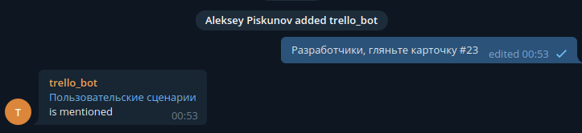

# tg-trello
## Что такое?
Бот для telegram, который будет по номерам карточек скидывать
ссылку и название карточки


## Как запустить?
Вам понадобится:
* добавить [расширение](https://trello.com/power-ups/59c3d177178a761767b49278/card-numbers-by-reenhanced) на доску
* Установить переменные:
  * [tg_trello_bot_bot_token](https://telegram.me/botfather)
  * [tg_trello_bot_trello_token и tg_trello_bot_trello_key](https://trello.com/app-key)
* И запускайте, например, так:
```bash
nohup python tg_trello/tg_bot.py > tg_bot.log 2>&1 &
```

\
_Заметьте, что бот [должен получить доступ](https://stackoverflow.com/questions/50204633/allow-bot-to-access-telegram-group-messages) к сообщениям чата_
